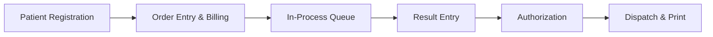
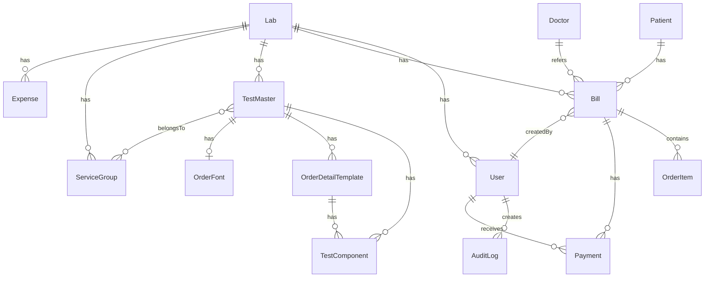

# Medfile Labs — LIMS Platform: Complete Technical Documentation

**Project:** Medfile Labs — Laboratory Information Management System (LIMS)
**Version:** 0.1.0
**Analysis Date:** 2026-05-15
**Codebase Size:** ~16,219 lines of source code (TypeScript/TSX/CSS)

---

## 1. Executive Summary

**Medfile Labs** is a full-stack **Laboratory Information Management System (LIMS)** built for diagnostic centers and pathology labs in India. It digitizes the complete lab workflow from patient registration → order creation → lab result entry → report authorization → bill dispatch.

### Target Users
| Role | Description |
|------|------------|
| **Lab Owner/Admin** | Full system access — dashboard, settings, reports, order maintenance, user management |
| **Reception Staff** | Patient registration, order entry, billing, completed bills |
| **Lab Technician** | Result entry (panel, richtext, microbiology, immunology), authorization workflow |

### Core Workflow


### Business Logic
- **Multi-lab architecture** — each Lab entity has its own users, tests, bills, and expenses
- **Role-based access** — Owner, Reception, LabEntry roles with sidebar filtering
- **Bill lifecycle** — InProcess → Completed → Authorized (Verified) → Dispatched
- **Referral doctor tracking** with commission percentage calculation
- **Multiple result entry UIs** — richtext (radiology), panel (blood tests), single value, microbiology culture, immunology
- **Template system** — reusable diagnostic report templates with age/gender-based component ranges

---

## 2. Technology Stack

### Frontend
| Technology | Version | Purpose |
|-----------|---------|---------|
| **Next.js** | 16.2.4 | Full-stack React framework (App Router) |
| **React** | 19.2.4 | UI library |
| **TypeScript** | ^5 | Type safety |
| **Lucide React** | ^1.11.0 | Icon library |
| **React Quill New** | ^3.8.3 | Rich text editor for diagnostic reports |
| **React to Print** | ^3.3.0 | Browser-based PDF/print generation |
| **Vanilla CSS** | — | Custom design system with CSS variables |

### Backend
| Technology | Version | Purpose |
|-----------|---------|---------|
| **Next.js API Routes** | 16.2.4 | RESTful API endpoints (App Router `route.ts`) |
| **Prisma ORM** | ^6.19.3 | Database access layer with type-safe queries |
| **NextAuth.js** | ^4.24.14 | Authentication (Credentials provider + JWT) |
| **bcryptjs** | ^3.0.3 | Password hashing |
| **pdf-parse** | ^2.4.5 | PDF text extraction (for order import) |

### Database
| Technology | Details |
|-----------|---------|
| **PostgreSQL** | Hosted on Railway (`yamanote.proxy.rlwy.net:53508`) |
| **Prisma Client** | Auto-generated type-safe ORM |

### Testing & CI/CD
| Technology | Purpose |
|-----------|---------|
| **Playwright** | ^1.59.1 — End-to-end browser testing |
| **GitHub Actions** | CI pipeline for Playwright tests on push/PR |
| **ESLint** | ^9 — Code linting with next config |

### State Management
- **React `useState`/`useEffect`** — All state is local component state
- **React Context API** — `ThemeContext` (light/dark mode), `ToastContext` (notifications)
- **NextAuth `SessionProvider`** — Authentication session management
- **No global state library** (no Redux, Zustand, or Jotai)

### Design System
- **Custom CSS** with CSS variables (`globals.css` — 1,292 lines)
- **Inter font** from Google Fonts
- **Dark mode** via `[data-theme="dark"]` CSS selector
- **Component classes**: `.btn`, `.card`, `.form-input`, `.data-table`, `.modal`, `.metric-card`, `.toast`

---

## 3. Folder Structure

```
image2/
├── .env                          # Environment variables (DB URL, NextAuth secrets)
├── .github/workflows/            # GitHub Actions CI (Playwright)
├── prisma/
│   ├── schema.prisma             # Database schema (18 models, 299 lines)
│   ├── seed.ts                   # Database seeding script
│   └── seed-templates.ts         # Template seeding
├── public/                       # Static assets
├── src/
│   ├── app/
│   │   ├── layout.tsx            # Root layout (Providers + Theme + Toast)
│   │   ├── page.tsx              # Root redirect (→ /order-entry or /login)
│   │   ├── globals.css           # Design system (1,292 lines)
│   │   ├── (auth)/
│   │   │   └── login/page.tsx    # Login page
│   │   ├── (dashboard)/
│   │   │   ├── layout.tsx        # Dashboard shell (Sidebar + TopNav + auth guard)
│   │   │   ├── order-entry/      # Main order entry form (2,338 lines!)
│   │   │   ├── in-process/       # Lab result entry workflow (1,847 lines!)
│   │   │   ├── completed-bills/  # Completed bills list + print
│   │   │   ├── previous-bills/   # Historical bills (USES DUMMY DATA)
│   │   │   ├── dashboard/        # Financial analytics (partial)
│   │   │   ├── order-maintenance/ # Test/order CRUD + components + templates
│   │   │   ├── doctors/          # Doctor management
│   │   │   ├── users/            # User management (USES HARDCODED DATA)
│   │   │   ├── settings/         # System settings (MOSTLY STATIC)
│   │   │   ├── reports/          # Reports module (PLACEHOLDER)
│   │   │   ├── work-sheet/       # Worksheet report config
│   │   │   ├── non-financial/    # Non-financial report config
│   │   │   ├── non-financial-status/
│   │   │   └── online-request-sample-status/
│   │   ├── api/                  # 18 API route directories
│   │   │   ├── auth/             # NextAuth handler
│   │   │   ├── patients/         # CRUD + advanced search
│   │   │   ├── bills/            # Create, in-process, completed, dispatch, edit-dates
│   │   │   ├── orders/           # Result entry, authorization
│   │   │   ├── tests/            # Test master CRUD + templates + components
│   │   │   ├── doctors/          # Doctor CRUD
│   │   │   ├── sources/          # Patient source management
│   │   │   ├── signatures/       # Doctor signature management
│   │   │   ├── dashboard/        # Financial statistics
│   │   │   ├── expenses/         # Expense tracking
│   │   │   ├── upload/           # File upload
│   │   │   ├── search/           # Global search
│   │   │   ├── sample-types/     # Sample type master
│   │   │   ├── order-types/      # Order type master
│   │   │   ├── billing-categories/ # Billing category master
│   │   │   ├── service-groups/   # Service group management
│   │   │   ├── lab/              # Lab default font settings
│   │   │   └── components/       # Component search
│   │   └── reports/in-process/   # Printable report pages
│   ├── components/
│   │   ├── layout/
│   │   │   ├── Sidebar.tsx       # Navigation sidebar with role filtering
│   │   │   └── TopNav.tsx        # Context-sensitive action bar
│   │   ├── modals/
│   │   │   ├── AddOrderModal.tsx # Full-page order creation (742 lines)
│   │   │   ├── PastOrdersModal.tsx
│   │   │   └── DoctorModal.tsx   # Doctor add/edit modal
│   │   ├── RichTextEditor.tsx    # Quill-based rich text editor
│   │   ├── PrintableBill.tsx     # Print-optimized bill layout
│   │   └── Providers.tsx         # NextAuth SessionProvider wrapper
│   ├── context/
│   │   ├── ThemeContext.tsx       # Light/dark theme toggle
│   │   └── ToastContext.tsx       # Toast notification system
│   └── lib/
│       ├── prisma.ts             # Prisma client singleton
│       └── auth.ts               # NextAuth configuration
├── tests/                        # Playwright test specs
├── scratch/                      # Development utility scripts
├── package.json
├── tsconfig.json
└── playwright.config.ts
```

---

## 4. Database Schema Analysis

### 4.1 Models Overview (18 Tables)

| Model | Fields | Purpose | Relations |
|-------|--------|---------|-----------|
| **Lab** | 9 | Multi-lab entity | → Bills, Expenses, ServiceGroups, Tests, Users |
| **User** | 9 | System users | → Lab, Bills, Payments, AuditLogs |
| **Patient** | 12 | Patient registry | → Bills |
| **Doctor** | 13 | Referral doctors | → Bills |
| **Bill** | 14 | Billing records | → Patient, Doctor, Lab, User, OrderItems, Payments |
| **OrderItem** | 14 | Lab test orders | → Bill |
| **Payment** | 7 | Payment records | → Bill, User |
| **TestMaster** | 22 | Test catalog | → Lab, Components, Templates, ServiceGroups, OrderFont |
| **ServiceGroup** | 6 | Test grouping | → Lab, Tests (M2M) |
| **TestComponent** | 19 | Test parameters | → TestMaster, OrderDetailTemplate |
| **Expense** | 7 | Expense tracking | → Lab |
| **AuditLog** | 7 | Audit trail | → User |
| **Source** | 3 | Patient sources | — |
| **SampleType** | 3 | Sample types | — |
| **OrderType** | 3 | Order types | — |
| **IPBillingCategory** | 3 | Billing categories | — |
| **DoctorSignature** | 7 | Digital signatures | — |
| **OrderFont** | 13 | Per-test font config | → TestMaster |
| **OrderDetailTemplate** | 9 | Age/gender templates | → TestMaster, Components |

### 4.2 ER Diagram (Conceptual)



### 4.3 Schema Issues Found

| Issue | Severity | Details |
|-------|----------|---------|
| ⚠️ No indexes on search fields | Medium | `Patient.phone`, `Patient.name`, `Bill.status`, `Doctor.name` lack explicit indexes |
| ⚠️ `TestMaster.testName` not unique | Medium | Duplicate test names possible; POST endpoint checks via Prisma error code only |
| ⚠️ No soft-delete pattern | Low | Records are status-flagged but no `deletedAt` timestamp |
| ⚠️ `OrderItem.resultData` is `String?` | Low | Stores JSON as string — should be `Json?` for querying |
| ⚠️ No `labId` filter on many queries | High | Multi-lab isolation not enforced in API routes |
| ⚠️ `Bill.billNumber` sequential generation | Medium | Race condition possible under concurrent inserts even with `$transaction` |
# Medfile Labs — Documentation Part 2: Feature & Code Analysis

---

## 5. Complete Feature Analysis

### 5.1 Order Entry Module (`order-entry/page.tsx` — 2,338 lines)

**The largest and most critical module.** Handles the entire patient registration and billing workflow.

| Sub-Feature | Status | Details |
|-------------|--------|---------|
| Patient quick search (Phone/UMR) | ✅ Completed | Real-time API lookup with debounce |
| Patient creation (inline) | ✅ Completed | Auto-generates UMR-XXXXXX |
| Patient update (inline edit) | ✅ Completed | Modification tracking with diff detection |
| Advanced patient search modal | ✅ Completed | Multi-field search (name, UMR, phone, age, gender, doctor, source) |
| Duplicate patient detection | ✅ Completed | Auto-checks on phone number entry |
| Order autocomplete search | ✅ Completed | Debounced test search with dropdown |
| Order add/remove from bill | ✅ Completed | Dynamic order list with auto-numbering |
| Doctor autocomplete | ✅ Completed | Search-as-you-type with API |
| Source autocomplete + management | ✅ Completed | CRUD for patient sources |
| Discount management | ✅ Completed | Amount + reason with modal |
| Payment tracking | ✅ Completed | Cash/Card/UPI/Online with reference number |
| Bill submission | ✅ Completed | Atomic transaction with patient + bill + orders + payment |
| Past orders modal | ✅ Completed | View patient history, repeat orders |
| Additional patient details | ✅ Completed | Insurance, passport, category, prescription upload |
| File upload (prescription) | ✅ Completed | Uploads to `/public/uploads/` |
| Add Doctor inline modal | ✅ Completed | Full doctor form with commission % |
| Add Expense modal | ✅ Completed | Expense tracking per lab |
| Keyboard shortcuts | ✅ Completed | Alt+O/I/C/P for navigation |
| Bill details modal | ⚠️ Partial | Modal exists but limited functionality |
| TopNav disabled state sync | ✅ Completed | Submit button disabled until form valid |

> **🐞 Bug:** `localStorage.getItem('medfile-user')` used on root page for redirect, but `localStorage.getItem('user')` used in AddOrderModal for `labId`. Key mismatch.

> **🔒 Security:** Patient creation has no server-side auth check — any unauthenticated request to `POST /api/patients` succeeds.

### 5.2 In-Process Module (`in-process/page.tsx` — 1,847 lines)

**Second-largest module.** Full lab result entry workflow.

| Sub-Feature | Status | Details |
|-------------|--------|---------|
| In-process bill list | ✅ Completed | Live data with status badges (IN PROCESS/COMPLETED/AUTHORIZED) |
| Search/filter bills | ✅ Completed | Client-side filtering by patient, bill number, orders, phone |
| Bill detail view | ✅ Completed | Patient info + order list with workflow pipeline |
| Result entry — Rich Text | ✅ Completed | Quill editor with template loading |
| Result entry — Panel (numeric) | ✅ Completed | Component-based with normal ranges, male/female ranges |
| Result entry — Single value | ✅ Completed | Simple text input |
| Result entry — Microbiology | ✅ Completed | Organism, growth, colony count, antibiotic sensitivity |
| Result entry — Immunology | ✅ Completed | Result, method, titer fields |
| Template caching | ✅ Completed | In-memory cache by order ID |
| Save draft / Mark complete | ✅ Completed | Entered → Completed status flow |
| Authorization | ✅ Completed | Batch authorize all orders on a bill |
| Dispatch modal | ✅ Completed | Date/time dispatch with API |
| Edit order dates | ✅ Completed | Modify bill/order timestamps |
| Edit patient details (in-process) | ✅ Completed | Update patient info from bill view |
| Doctor signature selection | ✅ Completed | Dropdown of configured signatures |
| Print report | ✅ Completed | `react-to-print` with formatted output |
| Template-driven report views | ✅ Completed | Rich text templates loaded from test master |
| Add order to existing bill | ⚠️ Partial | AddOrderModal integrated but limited |
| Referral/service doctor assignment | ✅ Completed | Dropdown populated from `/api/doctors` |
| Workflow pipeline visualization | ✅ Completed | Billed → In Process → Completed → Authorized → Dispatch |

### 5.3 Completed Bills (`completed-bills/page.tsx`)

| Sub-Feature | Status | Details |
|-------------|--------|---------|
| Bill list with patient details | ✅ Completed | Live API data |
| Print bill (tax invoice) | ✅ Completed | `PrintableBill` component with `react-to-print` |
| Bill payment modal | ⚠️ Partial | Modal renders but **Submit button is non-functional** — no API call |
| Mobile responsive cards | ✅ Completed | Hidden on desktop, shown on mobile |
| Orders list button | ❌ Not Implemented | Button exists but has no `onClick` handler |

> **🐞 Bug:** Payment modal displays hardcoded `₹1000` for "Paid till now" and `₹{balance + 1000}` for billed amount — not real data.

### 5.4 Previous Bills (`previous-bills/page.tsx`)

| Sub-Feature | Status | Details |
|-------------|--------|---------|
| Bill history list | ❌ Uses Dummy Data | **Hardcoded 10 demo rows** — no API integration |
| Search filters panel | ❌ Not Implemented | UI renders but no search functionality |
| Report buttons | ❌ Not Implemented | ShiftCollectionDetailed, ShiftCollection, SummaryReport — no handlers |

> **🐞 Critical:** This entire page uses static dummy data. No API call to fetch real historical bills.

### 5.5 Dashboard (`dashboard/page.tsx`)

| Sub-Feature | Status | Details |
|-------------|--------|---------|
| Financial overview (users, bills, amounts) | ✅ Completed | Live API data from `/api/dashboard` |
| Cancelled/refunded bill stats | ✅ Completed | Aggregate queries |
| Bill Analytics tab | ❌ Placeholder | "Charts coming soon" |
| Order Statistics tab | ❌ Placeholder | "Analytics coming soon" |
| Billing Category tab | ❌ Placeholder | "Category breakdown coming soon" |

### 5.6 Order Maintenance (`order-maintenance/`)

| Sub-Feature | Status | Details |
|-------------|--------|---------|
| Test/order list with pagination | ✅ Completed | 50 items per page, search, status display |
| Create new order | ✅ Completed | Full form with rich text template editor |
| Edit existing order | ✅ Completed | Navigates to `/order-maintenance/[id]/edit` |
| Test components management | ✅ Completed | `/order-maintenance/[id]/components` page |
| Template management | ✅ Completed | Age/gender-based templates with components |
| Service groups | ✅ Completed | Group tests with combined pricing |
| Lab default font settings | ✅ Completed | Global font configuration modal |
| Print price list | ✅ Completed | CSS print media with formatted layout |
| Export to CSV/Excel | ✅ Completed | Client-side CSV generation with BOM |
| Copy template between tests | ✅ Completed | API endpoint exists |
| Link components | ✅ Completed | API endpoint exists |

### 5.7 Doctors Management (`doctors/page.tsx`)

| Sub-Feature | Status | Details |
|-------------|--------|---------|
| Doctor list with pagination | ✅ Completed | Debounced search, 50 per page |
| Add/edit doctor | ✅ Completed | Full modal with validation |
| Commission percentage tracking | ✅ Completed | 0-100% validation |
| Doctor type filtering | ✅ Completed | Referral / Service Provider / Both |
| Tabs (Sales Executives, etc.) | ❌ Not Implemented | Only "All Doctors" tab works |

### 5.8 Users Management (`users/page.tsx`)

| Sub-Feature | Status | Details |
|-------------|--------|---------|
| User list | ❌ Hardcoded Data | 3 static users — no API integration |
| Add user | ❌ Not Implemented | Button exists, no handler |
| Edit user | ❌ Not Implemented | Button exists, no handler |
| Deactivate user | ❌ Not Implemented | Button exists, no handler |

### 5.9 Settings (`settings/page.tsx`)

| Sub-Feature | Status | Details |
|-------------|--------|---------|
| Lab Profile form | ⚠️ Partial | Form renders with hardcoded defaults, **Save button non-functional** |
| Multi-Lab Management | ❌ Hardcoded Data | Static table with 3 hardcoded branches |
| User Management tab | ❌ Hardcoded Data | Duplicate of Users page with static data |
| Test Master Data tab | ❌ Hardcoded Data | 3 static test rows |
| Preferences tab | ⚠️ Partial | Form renders, **Save button non-functional** |
| Role-based access check | ✅ Completed | Only "Owner" role can view |

### 5.10 Reports (`reports/page.tsx`)

| Sub-Feature | Status | Details |
|-------------|--------|---------|
| Report type sidebar | ✅ Completed | 9 report categories listed |
| Report generation | ❌ Not Implemented | All tabs show "coming soon" placeholder |

### 5.11 Report Config Pages

| Page | Status | Details |
|------|--------|---------|
| Work Sheet Config | ✅ Completed | Date/bill range → opens printable report |
| Non-Financial Config | ✅ Completed | Date range → opens printable report |
| Non-Financial Status | ✅ Completed | Date range config page |
| Online Request Sample Status | ✅ Completed | Date range config page |
| Printable report pages | ✅ Completed | Located in `/reports/in-process/` |

---

## 6. Frontend Deep Analysis

### 6.1 Pages (16 total)

| Page Route | Lines | Complexity | API Connected |
|-----------|-------|-----------|--------------|
| `/order-entry` | 2,338 | 🔴 Very High | ✅ Yes |
| `/in-process` | 1,847 | 🔴 Very High | ✅ Yes |
| `/order-maintenance` | 412 | 🟡 Medium | ✅ Yes |
| `/order-maintenance/add` | — | 🟡 Medium | ✅ Yes |
| `/order-maintenance/[id]/edit` | — | 🟡 Medium | ✅ Yes |
| `/order-maintenance/[id]/components` | — | 🟡 Medium | ✅ Yes |
| `/order-maintenance/[id]/templates` | — | 🟡 Medium | ✅ Yes |
| `/order-maintenance/service-groups` | — | 🟡 Medium | ✅ Yes |
| `/completed-bills` | 225 | 🟢 Low | ✅ Yes |
| `/previous-bills` | 77 | 🟢 Low | ❌ Dummy |
| `/dashboard` | 100 | 🟢 Low | ✅ Yes |
| `/doctors` | 227 | 🟡 Medium | ✅ Yes |
| `/users` | 39 | 🟢 Low | ❌ Hardcoded |
| `/settings` | 265 | 🟡 Medium | ❌ Mostly static |
| `/reports` | 36 | 🟢 Low | ❌ Placeholder |
| `/work-sheet` | 369 | 🟡 Medium | ✅ Yes |

### 6.2 Components (7 total)

| Component | Lines | Reusable | Purpose |
|-----------|-------|----------|---------|
| `Sidebar.tsx` | 160 | ✅ | Navigation with role-based filtering |
| `TopNav.tsx` | 116 | ✅ | Context-sensitive action bar |
| `AddOrderModal.tsx` | 742 | ✅ | Full-page test/order creation form |
| `DoctorModal.tsx` | 263 | ✅ | Doctor add/edit modal |
| `PastOrdersModal.tsx` | — | ✅ | Patient order history |
| `PrintableBill.tsx` | 101 | ✅ | Print-optimized invoice |
| `RichTextEditor.tsx` | — | ✅ | Quill editor wrapper |
| `Providers.tsx` | 8 | ✅ | NextAuth SessionProvider |

### 6.3 Issues Found

| Category | Issue | Severity |
|----------|-------|----------|
| **Dead Code** | `showAddOrderModal` state in `order-maintenance/page.tsx` — declared but never triggers the modal | Low |
| **Dead Code** | `searchQuery` state in `order-entry` — declared but input field commented out or unused in some flows | Low |
| **Unused Import** | `useTheme` imported in `order-maintenance/page.tsx` but never used | Low |
| **Missing Validation** | Phone number allows any input; only validated at submit time (10 digits) | Medium |
| **Missing Validation** | Email fields have no format validation anywhere | Medium |
| **Hardcoded Values** | Demo credentials displayed on login page in production code | 🔴 High |
| **Hardcoded Values** | Lab name "IMAGEE DIAGNOSTICS SERVICES" hardcoded in print price list | Medium |
| **Hardcoded Values** | "123 Health Ave, Hyderabad" hardcoded in PrintableBill header | Medium |
| **Hardcoded Values** | Default user fallback `{ id: 1, labId: 1 }` in bill submission | Medium |
| **Repeated Logic** | Date formatting helper duplicated across work-sheet, non-financial, non-financial-status pages | Medium |
| **Repeated Logic** | Department options list duplicated in AddOrderModal and DoctorModal | Medium |
| **Repeated Logic** | Autocomplete dropdown + debounce pattern repeated 3 times in order-entry | Medium |
| **Performance** | Order entry page has 50+ `useState` hooks — massive state object | 🔴 High |
| **Performance** | In-process page re-renders entire bill list on every result save | Medium |
| **Responsiveness** | Mobile sidebar overlay CSS uses inline `display: none` | Low |
| **Error Handling** | Many `catch` blocks only `console.error` — no user feedback | Medium |
| **Inline Styles** | Extensive inline `style={{}}` objects instead of CSS classes | Medium |

---

## 7. Backend Deep Analysis

### 7.1 API Routes (30+ endpoints across 18 directories)

| Route | Methods | Auth | Validation | Notes |
|-------|---------|------|-----------|-------|
| `POST /api/patients` | POST | ❌ None | Phone required | No auth check |
| `GET /api/patients` | GET | ❌ None | — | Search by name/phone/UMR |
| `PUT /api/patients/[id]` | PUT | ❌ None | — | Update patient |
| `POST /api/patients/advanced-search` | POST | ❌ None | — | Multi-field search |
| `GET /api/patients/[id]/orders` | GET | ❌ None | — | Patient order history |
| `POST /api/bills` | POST | ❌ None | Patient + orders required | Bill creation with transaction |
| `GET /api/bills/in-process` | GET | ❌ None | — | Advanced filtering support |
| `GET /api/bills/completed` | GET | ❌ None | — | Completed bills |
| `PUT /api/bills/[id]/dispatch` | PUT | ❌ None | — | Mark as dispatched |
| `PUT /api/bills/[id]/edit-dates` | PUT | ❌ None | — | Modify timestamps |
| `PUT /api/bills/[id]/patient-details` | PUT | ❌ None | — | Update patient from bill |
| `PUT /api/orders/[id]/result` | PUT | ❌ None | — | Save result data |
| `PUT /api/orders/[id]/authorize` | PUT | ❌ None | — | Mark as verified |
| `GET/POST /api/tests` | GET, POST | ❌ None | Name required | Test CRUD |
| `PUT /api/tests/[id]` | PUT | ❌ None | — | Update test |
| `GET/POST /api/doctors` | GET, POST | ❌ None | Name required, dupe check | Doctor CRUD |
| `PUT /api/doctors/[id]` | PUT | ❌ None | — | Update doctor |
| `GET/POST /api/sources` | GET, POST | ❌ None | — | Source CRUD |
| `PUT /api/sources/[id]` | PUT | ❌ None | — | Update source |
| `GET /api/signatures` | GET | ❌ None | — | List signatures |
| `POST /api/signatures` | POST | ❌ None | — | Update signature image |
| `GET /api/dashboard` | GET | ❌ None | — | Financial stats |
| `POST /api/expenses` | POST | ❌ None | — | Create expense |
| `POST /api/upload` | POST | ❌ None | — | File upload |
| `GET /api/sample-types` | GET | ❌ None | — | List sample types |
| `POST /api/sample-types` | POST | ❌ None | — | Create sample type |
| `GET /api/order-types` | GET | ❌ None | — | List order types |
| `GET /api/billing-categories` | GET | ❌ None | — | List billing categories |
| `GET/POST /api/service-groups` | GET, POST | ❌ None | — | Service group CRUD |
| `GET/POST /api/lab/default-font` | GET, POST | ❌ None | — | Lab font config |
| `GET /api/tests/template` | GET | ❌ None | — | Get test template by name |
| `POST /api/tests/[id]/copy-template` | POST | ❌ None | — | Copy template |
| `POST /api/tests/[id]/link-component` | POST | ❌ None | — | Link component |

### 7.2 Critical Backend Issues

| Issue | Severity | Details |
|-------|----------|---------|
| 🔒 **No API authentication** | 🔴 Critical | **ZERO API routes verify auth tokens.** All endpoints are publicly accessible. |
| 🔒 **No authorization checks** | 🔴 Critical | No role-based checks. Any request can create/edit/delete data. |
| 🔒 **No multi-lab isolation** | 🔴 Critical | Queries don't filter by `labId`. One lab can see another lab's data. |
| 🔒 **File upload — no validation** | 🔴 High | `/api/upload` accepts any file type/size. No MIME check. No size limit. Path traversal risk. |
| 🔒 **No CSRF protection** | High | API routes accept cross-origin POST requests |
| 🔒 **No rate limiting** | Medium | No throttling on search/login endpoints |
| ⚠️ **No input sanitization** | High | Rich text HTML stored and rendered via `dangerouslySetInnerHTML` — XSS risk |
| ⚠️ **Prisma debug logging in production** | Low | `console.log("RELOADING PRISMA CLIENT...")` in `prisma.ts` |
| ⚠️ **Missing error details** | Medium | Most error responses return generic "Failed to..." messages |
| ⚠️ **No pagination on bill queries** | Medium | `bills/completed` and `bills/in-process` return ALL records |
| ⚠️ **No request body size limits** | Medium | Large payloads could cause memory issues |
| ⚠️ **Upload directory not ensured** | Medium | `writeFile` to `/public/uploads/` assumes directory exists |
# Medfile Labs — Documentation Part 3: Security, Performance & Final Summary

---

## 8. Authentication & Authorization Analysis

### 8.1 Authentication System

| Component | Implementation | Status |
|-----------|---------------|--------|
| **Login flow** | NextAuth.js Credentials provider | ✅ Working |
| **Password hashing** | bcryptjs compare | ✅ Working |
| **Session management** | JWT strategy (stateless) | ✅ Working |
| **Session provider** | NextAuth `SessionProvider` wrapping app | ✅ Working |
| **Token storage** | HTTP-only cookies (NextAuth default) | ✅ Working |
| **Route protection (client)** | `useSession()` → redirect to `/login` if unauthenticated | ✅ Working |
| **Route protection (server)** | ❌ **NONE** | 🔴 Critical Gap |
| **Role-based UI filtering** | Sidebar hides admin items for non-Owner roles | ✅ Working |
| **Role-based API protection** | ❌ **NONE** | 🔴 Critical Gap |
| **Signup flow** | ❌ Not Implemented | No self-registration |
| **Email verification** | ❌ Not Implemented | — |
| **Forgot password** | ❌ Not Implemented | — |
| **Password complexity rules** | ❌ Not Implemented | — |
| **Account lockout** | ❌ Not Implemented | — |
| **Session expiry config** | Uses NextAuth defaults | ⚠️ Not customized |

### 8.2 Security Gaps

| Gap | Risk Level | Impact |
|-----|-----------|--------|
| API routes have no auth middleware | 🔴 Critical | Anyone can call any API without logging in |
| No server-side role checks | 🔴 Critical | Reception user could call admin-only APIs |
| No CORS configuration | High | Cross-origin requests accepted |
| Demo credentials on login page | High | `Imagee owner / gagan1112` visible to all |
| Hardcoded fallback secret | Medium | `"medfile-labs-super-secret-key-2026"` in auth.ts |
| Rich text stored as raw HTML | High | XSS via `dangerouslySetInnerHTML` in result rendering |
| No file upload validation | High | Arbitrary file upload to server filesystem |
| Database URL in `.env` (committed) | 🔴 Critical | Railway PostgreSQL credentials exposed in repo |
| `NEXTAUTH_SECRET` in `.env` | 🔴 Critical | JWT signing secret exposed |

---

## 9. Security Audit Summary

### 9.1 Vulnerability Assessment

| Vulnerability | Category | Severity | Location |
|--------------|----------|----------|----------|
| **Exposed database credentials** | Secrets Management | 🔴 Critical | `.env` file (DATABASE_URL with password) |
| **Exposed auth secret** | Secrets Management | 🔴 Critical | `.env` file (NEXTAUTH_SECRET) |
| **No API authentication** | Access Control | 🔴 Critical | All 30+ API routes |
| **No authorization checks** | Access Control | 🔴 Critical | All API routes |
| **XSS via dangerouslySetInnerHTML** | Injection | High | In-process result rendering |
| **Unrestricted file upload** | File Upload | High | `/api/upload/route.ts` |
| **No CSRF tokens** | Session Management | High | All POST/PUT endpoints |
| **SQL injection (mitigated)** | Injection | Low | Prisma ORM parameterizes queries |
| **No rate limiting** | DoS Protection | Medium | Login, search endpoints |
| **Hardcoded demo credentials** | Information Disclosure | Medium | Login page (`page.tsx`) |
| **No input length limits** | Input Validation | Medium | Patient name, doctor name, etc. |
| **Console.log in production** | Information Disclosure | Low | `prisma.ts` debug logging |

### 9.2 Recommendations (Priority Order)

1. **Immediately** add `.env` to `.gitignore` and rotate all credentials
2. Create API middleware that validates JWT on every API route
3. Add role-based checks (Owner/Reception/LabEntry) per endpoint
4. Add `labId` filtering to all queries for multi-tenant isolation
5. Sanitize HTML content before storage (DOMPurify)
6. Validate file uploads (type whitelist, size limit, sanitize filename)
7. Remove demo credentials from login page
8. Add CORS configuration
9. Add rate limiting to auth endpoints

---

## 10. Performance Analysis

| Issue | Impact | Location |
|-------|--------|----------|
| **2,338-line single component** | Slow initial render, massive state updates | `order-entry/page.tsx` |
| **1,847-line single component** | Same as above | `in-process/page.tsx` |
| **50+ useState hooks** in one component | Excessive re-renders on any state change | `order-entry/page.tsx` |
| **No pagination on completed bills** | All completed bills loaded at once | `/api/bills/completed` |
| **No pagination on in-process bills** | All in-process bills loaded at once | `/api/bills/in-process` |
| **All tests fetched at once** | `?all=true` loads entire test catalog | `order-maintenance/page.tsx` |
| **No database indexes** | Slow queries as data grows | `Patient.phone`, `Bill.status`, `Doctor.name` |
| **No caching** | Every page load hits the database | All API routes |
| **Dynamic imports** | ReactQuill loaded dynamically (correct) but no loading skeleton | `in-process/page.tsx` |
| **Template cache is in-memory only** | Lost on page refresh, only per-session | `in-process/page.tsx` |
| **No image optimization** | Static images not using Next.js `<Image>` | Various |
| **External font loading** | Google Fonts loaded synchronously | `globals.css` |
| **No bundle analysis** | Unknown bundle size | No `@next/bundle-analyzer` |

### Estimated Bundle Impact
- `react-quill-new`: ~250KB gzipped (loaded dynamically ✅)
- `lucide-react`: Tree-shakeable ✅
- `@prisma/client`: Server-only ✅

---

## 11. Code Quality Review

### 11.1 Scoring

| Metric | Score | Justification |
|--------|-------|--------------|
| **Code Quality** | 5/10 | Heavy use of `any` types, inline styles, massive components |
| **Maintainability** | 4/10 | Single 2,338-line component is unmaintainable. No component decomposition. |
| **Scalability** | 3/10 | No pagination, no caching, no auth middleware, monolithic components |
| **Type Safety** | 4/10 | TypeScript used but `any` type everywhere — `useState<any>`, `useState<any[]>` |
| **Naming** | 7/10 | Generally clear variable/function names |
| **Folder Organization** | 7/10 | Good Next.js App Router structure with route groups |
| **Reusability** | 5/10 | Some reusable components (modals), but much logic is page-specific |
| **Documentation** | 2/10 | No JSDoc, no README beyond boilerplate, no API docs |
| **Testing** | 2/10 | Only 1 Playwright test file (`example.spec.ts`), likely boilerplate |
| **Error Handling** | 4/10 | Frontend toast notifications exist but backend returns generic errors |

### 11.2 Key Quality Issues

- **Massive God components**: `order-entry` (2,338 lines) and `in-process` (1,847 lines) should each be split into 10-15 smaller components
- **`any` type abuse**: Nearly every state variable is typed as `any` or `any[]`
- **Inline CSS**: Hundreds of `style={{}}` objects that should be CSS classes
- **`styled jsx`**: Used in some components but not others — inconsistent approach
- **No error boundaries**: React error boundaries not implemented
- **Console.log/console.error**: Used as primary logging — no structured logging
- **No API response types**: API responses have no TypeScript interfaces

---

## 12. Deployment & DevOps Analysis

| Aspect | Status | Details |
|--------|--------|---------|
| **Database hosting** | ✅ Configured | Railway PostgreSQL |
| **CI/CD** | ⚠️ Basic | GitHub Actions for Playwright only, no deploy pipeline |
| **Environment variables** | 🔴 Insecure | `.env` likely committed to repo |
| **Production build** | ⚠️ Untested | No evidence of production deployment |
| **Docker** | ❌ None | No Dockerfile or docker-compose |
| **Vercel/Railway deploy** | ❌ Not configured | No `vercel.json` or Railway config |
| **Health checks** | ❌ None | No health check endpoint |
| **Logging** | ❌ None | Only `console.log/error` |
| **Monitoring** | ❌ None | No APM, error tracking, or metrics |
| **Backup** | ❌ Unknown | No database backup strategy documented |

---

## 13. Missing Features & Development Roadmap

### 🔴 High Priority (Critical for Production)

| Feature | Complexity | Est. Effort |
|---------|-----------|-------------|
| API authentication middleware | Medium | 2-3 days |
| Role-based authorization on all endpoints | Medium | 3-4 days |
| Multi-tenant (labId) data isolation | Medium | 2-3 days |
| Previous Bills — real API integration | Low | 1-2 days |
| Users page — real API integration + CRUD | Medium | 3-4 days |
| Settings page — save functionality | Low | 1-2 days |
| Bill payment submission (completed bills) | Low | 1 day |
| Remove exposed credentials from repo | Low | 0.5 days |
| Input sanitization (XSS prevention) | Medium | 2 days |

### 🟡 Medium Priority (Feature Completeness)

| Feature | Complexity | Est. Effort |
|---------|-----------|-------------|
| Reports module — actual report generation | High | 5-7 days |
| Dashboard charts (bills, orders, categories) | Medium | 3-4 days |
| Email verification | Medium | 2-3 days |
| Forgot password flow | Medium | 2-3 days |
| SMS notifications | High | 3-5 days |
| Audit log viewer | Medium | 2-3 days |
| Lab profile update (settings) | Low | 1-2 days |
| Pagination on all bill endpoints | Low | 1-2 days |
| Export reports to PDF/Excel | Medium | 3-4 days |
| Doctor commission reports | Medium | 2-3 days |
| Patient requests portal | High | 5-7 days |

### 🟢 Low Priority (Polish & Optimization)

| Feature | Complexity | Est. Effort |
|---------|-----------|-------------|
| Component decomposition (order-entry, in-process) | High | 5-7 days |
| Replace `any` types with proper interfaces | Medium | 3-4 days |
| Move inline styles to CSS classes | Medium | 3-4 days |
| Database indexes on search fields | Low | 0.5 days |
| API response caching | Medium | 2-3 days |
| Bundle size optimization | Low | 1-2 days |
| Comprehensive E2E test suite | High | 5-7 days |
| API documentation (Swagger/OpenAPI) | Medium | 2-3 days |
| Dark mode polish (some hardcoded colors) | Low | 1-2 days |
| Incoming Labs module | High | 5-7 days |
| Locations management | Medium | 2-3 days |

---

## 14. Final Project Status Summary

### Overall Completion

```
┌─────────────────────────────┬───────────┬──────────────┐
│ Category                    │ Score     │ Status       │
├─────────────────────────────┼───────────┼──────────────┤
│ Overall Completion          │ 55%       │ ⚠️ Alpha     │
│ Frontend Completion         │ 65%       │ ⚠️ Partial   │
│ Backend API Completion      │ 70%       │ ⚠️ Partial   │
│ Authentication/Security     │ 20%       │ 🔴 Critical  │
│ Admin Portal                │ 40%       │ 🔴 Incomplete│
│ Core Lab Workflow           │ 85%       │ ✅ Good      │
│ Reports & Analytics         │ 15%       │ 🔴 Minimal   │
│ Production Readiness        │ 15%       │ 🔴 Not Ready │
│ Code Quality                │ 40%       │ ⚠️ Needs Work│
│ Test Coverage               │ 5%        │ 🔴 Critical  │
└─────────────────────────────┴───────────┴──────────────┘
```

### Major Blockers for Production

1. **🔴 ZERO API authentication** — All data endpoints are publicly accessible
2. **🔴 Exposed credentials** — Database URL and auth secret in `.env`
3. **🔴 No multi-tenant isolation** — Lab data not filtered by labId
4. **🔴 XSS vulnerability** — Raw HTML rendered via `dangerouslySetInnerHTML`
5. **🔴 Unrestricted file uploads** — No type/size validation

### What Works Well ✅

1. **Core lab workflow** (Order Entry → In-Process → Result Entry → Authorization → Dispatch) is fully functional
2. **Multi-format result entry** (richtext, panel, single, microbiology, immunology) is comprehensive
3. **Patient management** with dedup detection, advanced search, and modification tracking
4. **Order/test management** with components, templates, age/gender ranges
5. **Design system** is cohesive with dark mode, responsive layout, toast notifications
6. **Print functionality** with professional invoice and report layouts
7. **Doctor management** with referral tracking and commission percentages

### Recommended Next Steps (Ordered)

1. **Security hardening** — Add API auth middleware, rotate credentials, add `.env` to `.gitignore`
2. **Complete core features** — Previous Bills API, Users CRUD, Settings save, Bill payment
3. **Refactor** — Split god components, replace `any` types, extract inline styles
4. **Reports** — Implement at least Bill Reports and Doctor Reports
5. **Testing** — Write E2E tests for core workflow
6. **Deploy** — Set up Vercel/Railway deployment with proper env management
7. **Monitor** — Add error tracking (Sentry) and basic metrics

---

## 15. Final Conclusion

**Medfile Labs** is a **functional but incomplete** LIMS platform. The **core diagnostic workflow** (patient → billing → lab processing → result entry → authorization → dispatch) is impressively well-built with multiple result entry formats and a professional UI. However, the project has **critical security vulnerabilities** (no API auth, exposed credentials, XSS) that make it **unsuitable for production deployment** in its current state.

The codebase suffers from **maintainability issues** — two 2,000+ line monolithic page components, pervasive `any` typing, and extensive inline styles. The admin and configuration modules are largely **static/hardcoded** rather than API-backed.

**Estimated effort to reach production-ready MVP:** 4-6 weeks of focused development, primarily on security, missing CRUD operations, reports, and code refactoring.

---

*Generated by deep codebase analysis on 2026-05-15*
